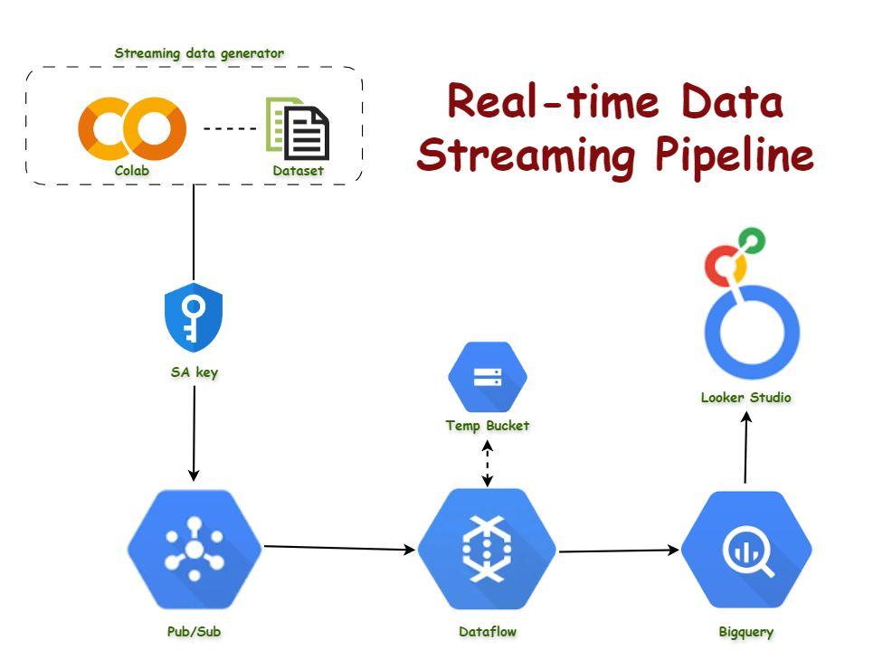

# Streaming Data Generator

The Streaming Data Generator is a project that simulates various data sources, such as IoT devices or user interactions on a website, and feeds the generated data into a data processing pipeline.

## Overview

The project follows the following workflow:

1. **Streaming Data Generation**: Data is generated from various sources, such as IoT devices or user interactions on a website. This data serves as the source of information for the project.

2. **Colab and Dataset**: The generated data is fed into Google Colab and stored in a Dataset for initial processing or storage. Colab provides a collaborative environment for data analysis and machine learning, while Dataset offers scalable storage for large datasets.

3. **Service Account (SA) Key**: Authentication and permissions are managed using a Service Account (SA) key. This key is used to authenticate and provide the necessary permissions to access the services in the Google Cloud Platform (GCP) ecosystem.

4. **Pub/Sub**: The data is then published to a Pub/Sub topic. Pub/Sub is a messaging service that allows you to send and receive messages between independent applications. It provides reliable, scalable, and asynchronous messaging between applications.

5. **Temp Bucket**: Temporary storage is utilized in Google Cloud Storage to store and retrieve the data. This temp bucket serves as an intermediary storage solution during the data processing pipeline.

6. **Dataflow**: Messages from the Pub/Sub topic are pulled by a Dataflow job. Dataflow is a fully-managed service for transforming and enriching data in stream (real-time) and batch modes. It provides a scalable and reliable way to process large volumes of data.

7. **BigQuery**: The transformed data from Dataflow is loaded into BigQuery. BigQuery is a web service from Google that is used for handling and analyzing big data. It offers a serverless, highly-scalable, and cost-effective solution for storing and querying large datasets.

8. **Looker Studio**: Finally, the data in BigQuery can be visualized using Looker Studio. Looker Studio is a business intelligence software and big data analytics platform that helps you explore, analyze, and share real-time business analytics easily. It provides interactive dashboards and visualizations for data analysis and reporting.

## Note
Please note that the actual implementation may vary based on the specific requirements of your project.

